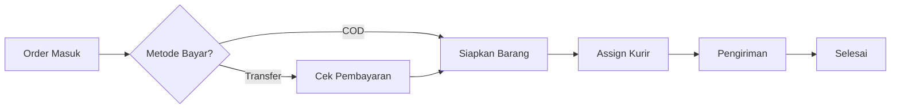

# Dokumentasi Sistem Migunani Motor (SOP & Alur Data)

Dokumen ini adalah **Panduan Operasional Sistem (SOP)** yang menjelaskan seluruh alur kerja dalam aplikasi Migunani Motor, mulai dari pendaftaran pengguna hingga perhitungan laba rugi. Dokumen ini ditujukan untuk pengembang, administrator sistem, dan manajemen.

---

## 1. Manajemen Pengguna & Akses (User Management)

Sistem membedakan pengguna menjadi dua kategori utama: **Customer** (Pelanggan) dan **Staff** (Karyawan).

### A. Registrasi Pelanggan (Customer Register)
1.  **Input**: Nama, Email (opsional), Nomor WhatsApp, Password.
2.  **Validasi**:
    *   Sistem mengecek apakah Email atau No WA sudah terdaftar.
    *   Jika belum, akun dibuat dengan role `customer`.
    *   Otomatis membuat record `CustomerProfile` (Tier: Regular, Poin: 0).
3.  **Output**: User bisa login dan mulai berbelanja.

### B. Login Sistem
1.  **Metode**: Bisa menggunakan Email ATAU Nomor WhatsApp + Password.
2.  **Keamanan**: Password di-hash menggunakan `bcrypt`. Token sesi (JWT) diberikan setelah login berhasil.
3.  **Akses**: Token mengandung `role` yang membatasi akses menu (Middleware Guard).

### C. Manajemen Staf (Oleh Super Admin)
Super Admin memiliki menu khusus untuk menambah karyawan.
*   **Role Tersedia**: `admin_gudang`, `admin_finance`, `driver`, `kasir`.
*   **Proses**: Admin menginput Nama & No WA staf -> Sistem membuat akun dengan role spesifik.
*   **Non-aktifkan Staf**: Admin bisa mengubah status staf jadi `banned` jika karyawan resign, mencabut akses login mereka secara instan.

---

## 2. Manajemen Produk & Stok (Inventory)

### A. Import Barang Massal (Excel)
Fitur utama untuk memasukkan ribuan data sparepart sekaligus.
1.  **Format File**: Mendukung `.xlsx`, `.xls`, `.csv`. Format kolom wajib: SKU, Nama Barang, Harga Beli, Harga Jual, Stok.
2.  **Validasi Cerdas**:
    *   Mendeteksi duplikasi SKU.
    *   Memperbaiki format angka (misal: `Rp 50.000` otomatis jadi `50000`).
    *   Memisahkan kategori otomatis (misal: "Ban, Tubeless" menjadi kategori "Ban" dan "Tubeless").
3.  **Eksekusi**: Data yang valid masuk ke tabel `Products`, kategori baru otomatis dibuat di tabel `Categories`.

### B. Manajemen Kategori
*   **Otomatis**: Dibuat saat import barang.
*   **Manual**: Admin bisa menambah/edit nama kategori untuk merapikan katalog di aplikasi pelanggan.

---

## 3. Alur Penjualan (Order Fulfillment Workflow)

Alur pesanan dibagi menjadi dua jalur utama berdasarkan metode pembayaran: **Transfer** dan **COD**.

### Diagram Alur Umum

### Detail Birokrasi Status (`orders.status`)

#### Tahap 1: Pesanan Baru
*   **Status**: `pending` atau `waiting_invoice`
*   **Aktor**: Customer / Sales Admin
*   **Sistem**: Invoice dibuat dengan status `unpaid`. Stok barang masuk status `allocated` (terpesan, tidak bisa dibeli orang lain).

#### Tahap 2: Pembayaran (Khusus Transfer)
*   **Status**: `waiting_payment` ➔ `ready_to_ship`
*   **Aktor**: Customer Upload Bukti ➔ **Admin Finance** Verifikasi.
*   **Sistem**: Jika Finance klik "Approve", status order maju ke `ready_to_ship`. Jika COD, tahap ini dilewati otomatis.

#### Tahap 3: Pemenuhan Gudang
*   **Status**: `ready_to_ship` ➔ `shipped`
*   **Aktor**: **Admin Gudang**.
*   **Tugas**: Packing barang fisik ➔ Pilih tombol "Assign Kurir" ➔ Pilih nama Driver.
*   **Sistem**: Pesanan muncul di aplikasi Driver yang dipilih.

#### Tahap 4: Pengiriman (Last Mile)
*   **Status**: `shipped` ➔ `delivered`
*   **Aktor**: **Driver**.
*   **Tugas**: Antar barang ➔ Foto penerima/rumah ➔ Klik "Selesaikan Pengiriman" di aplikasi.
*   **Sistem**: Foto bukti tersimpan di server.

#### Tahap 5: Penyelesaian (Settlement)
*   **Transfer**: Otomatis `completed` setelah Driver upload bukti.
*   **COD**: Masih `delivered` sampai Driver setor uang (Lihat Bagian 5: Keuangan).

---

## 4. Alur Retur Barang (Returns)

Proses ketat untuk mencegah kecurangan dan kerugian barang.

1.  **Pengajuan**: Customer upload foto & alasan via aplikasi ➔ Status `pending`.
2.  **Validasi Gudang**: 
    *   **Admin Gudang** cek foto. 
    *   Jika valid, klik "Setujui" ➔ Status `approved`.
    *   Customer diberitahu bahwa retur disetujui.
3.  **Penugasan Jemputan (Gudang)**:
    *   Gudang menunjuk Driver untuk jemput barang.
    *   Gudang menentukan **Nominal Refund** yang harus dibayar.
    *   Status `pickup_assigned` ➔ Muncul di **Misi Driver** & **Dashboard Finance**.
4.  **Pencairan Dana (Finance)**:
    *   Finance melihat alert **"SEGERA CAIRKAN"**.
    *   Finance memberi uang Cash ke Driver (Refund + Uang Jalan).
5.  **Eksekusi Driver**: Jemput barang, bayar refund tunai ke customer.
6.  **Barang Masuk (Gudang)**:
    *   Driver serahkan barang ke Gudang.
    *   Gudang klik "Terima Barang" ➔ Status `received`.
    *   Gudang cek fisik: Pilih "Masuk Stok Kembali" atau "Buang/Rusak".
    *   Status `completed`.

---

## 5. Alur Keuangan (Finance & Accounting)

Admin Finance memiliki dashboard pusat (`Overview`) untuk semua aktivitas ini.

### A. Pengeluaran (Expenses)
*   **Input**: Kategori (Listrik/Gaji/Bensin), Jumlah, Tanggal, Catatan.
*   **Label**: Finance bisa membuat label pengeluaran rutin untuk mempercepat input.
*   **Dampak**: Langsung mengurangi Net Profit di laporan P&L.

### B. Piutang & Setoran COD (Accounts Receivable)
*   **Piutang Driver**: Uang COD yang sudah diterima Driver dari customer tapi belum disetor ke kantor.
*   **Proses Setoran**:
    1.  Driver datang ke Finance bawa uang.
    2.  Finance buka menu **"Setoran COD"**.
    3.  Muncul daftar order yang uangnya dibawa driver tersebut.
    4.  Finance hitung uang fisik, lalu klik "Terima Setoran".
    5.  Sistem mengubah Invoice jadi `paid` dan Order jadi `completed`.

### C. Laporan Laba Rugi (Profit & Loss)
Sistem menghitung P&L secara real-time dengan rumus:
1.  **Revenue (Omzet)**: Total `amount_paid` dari invoice yang statusnya `paid`.
2.  **COGS (HPP)**: Total modal barang (`cost_at_purchase`) dari barang yang terjual.
3.  **Gross Profit**: Revenue - COGS.
4.  **Net Profit**: Gross Profit - Total Expenses (Listrik, Gaji, dll).

---

## 6. Alur Driver (Mobile Operation)

Driver memiliki tampilan khusus (sederhana) untuk fokus di jalan.
*   **Daftar Tugas**:
    *   **Pengiriman (Delivery)**: Mengantar paket (Biru).
    *   **Penjemputan (Pickup)**: Mengambil retur (Kuning/Oranye).
*   **Detail**: Driver bisa melihat Nama, Alamat, No WA, dan Link Google Maps.
*   **Bukti**: Driver wajib upload foto saat menyelesaikan tugas pengiriman.
